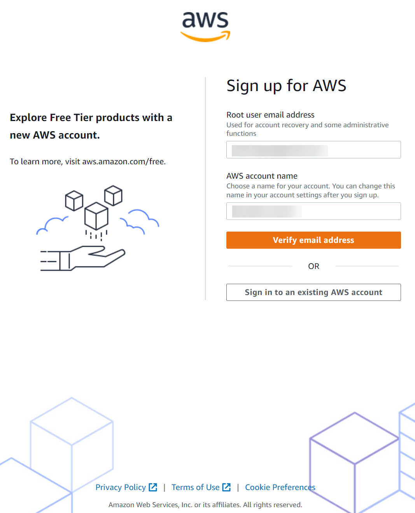
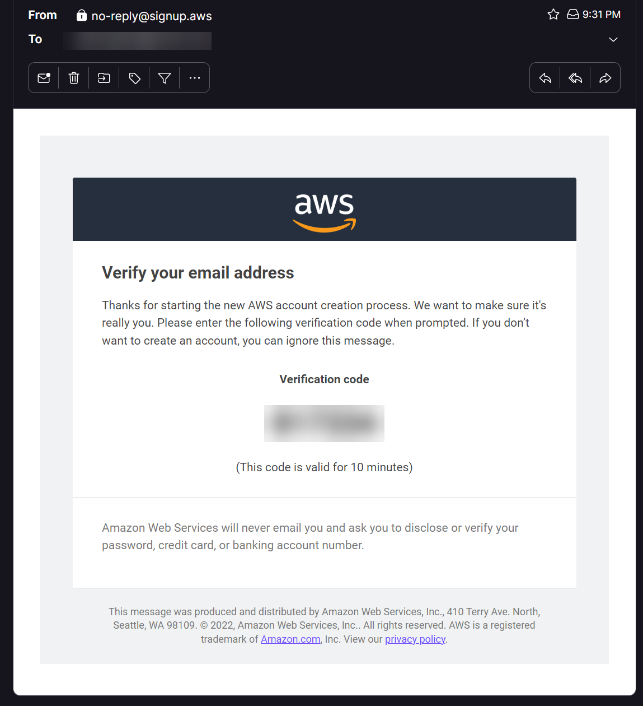
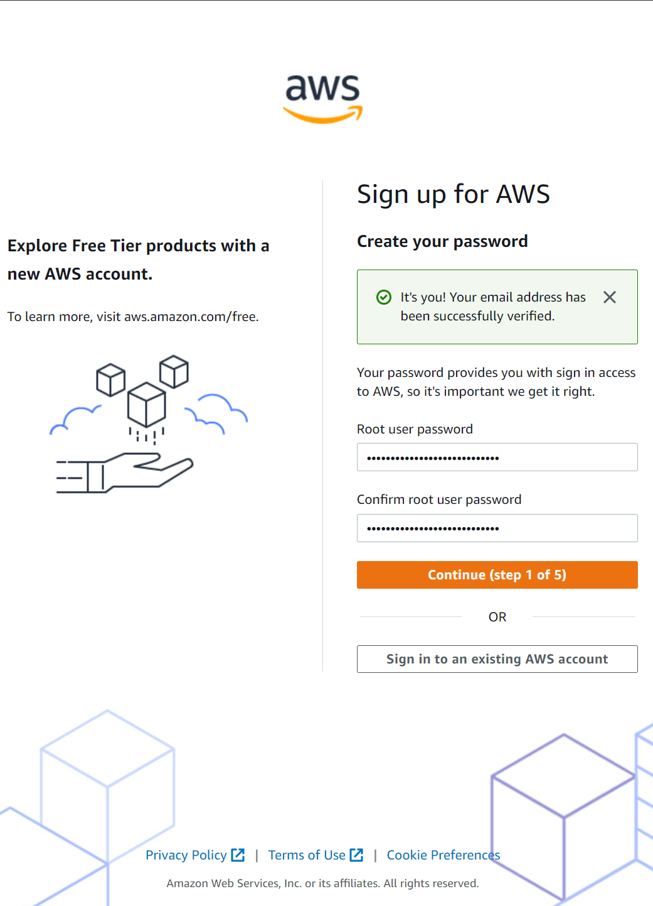
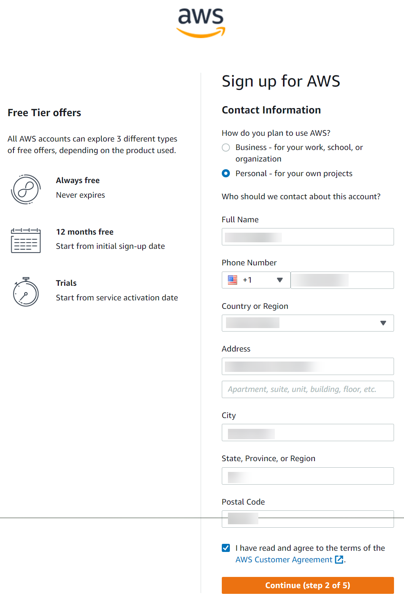
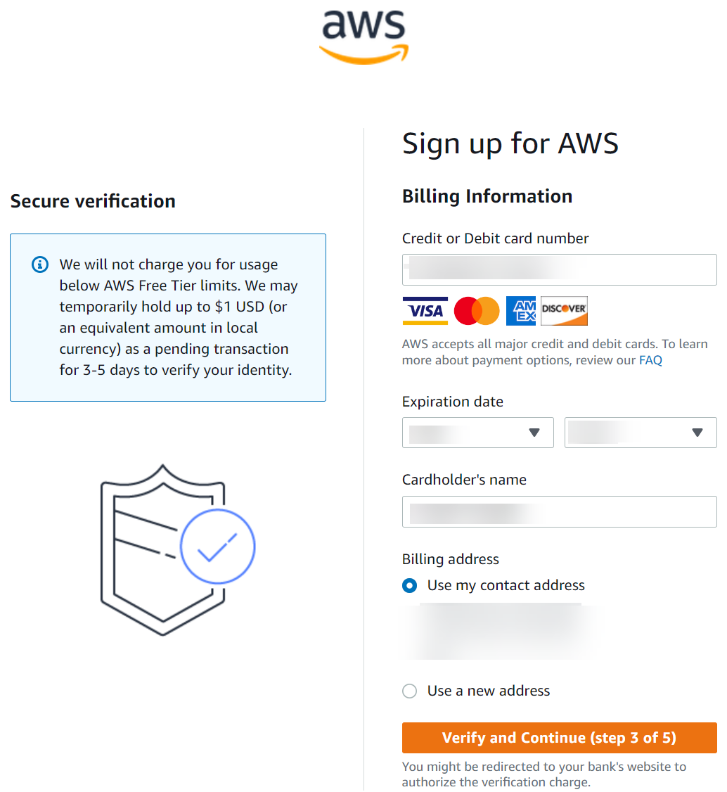
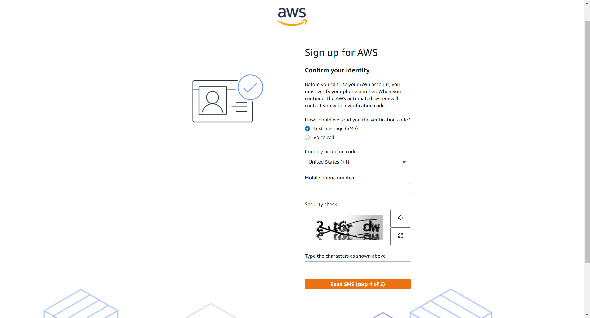
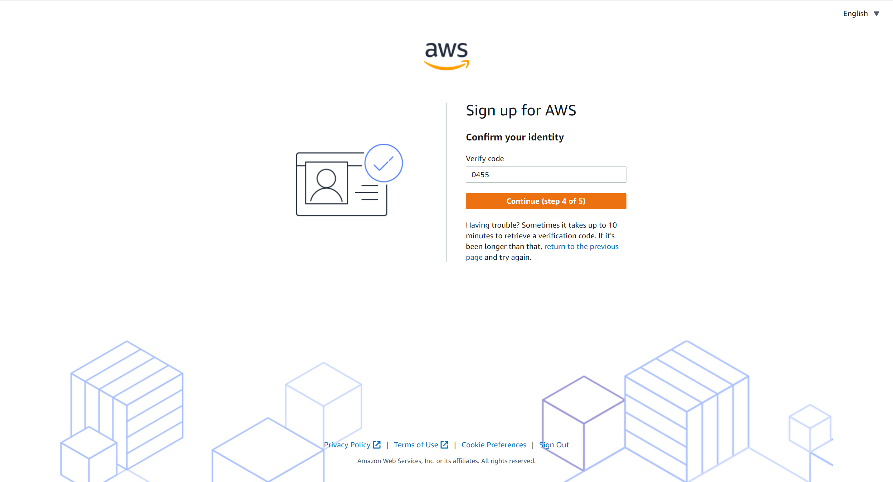
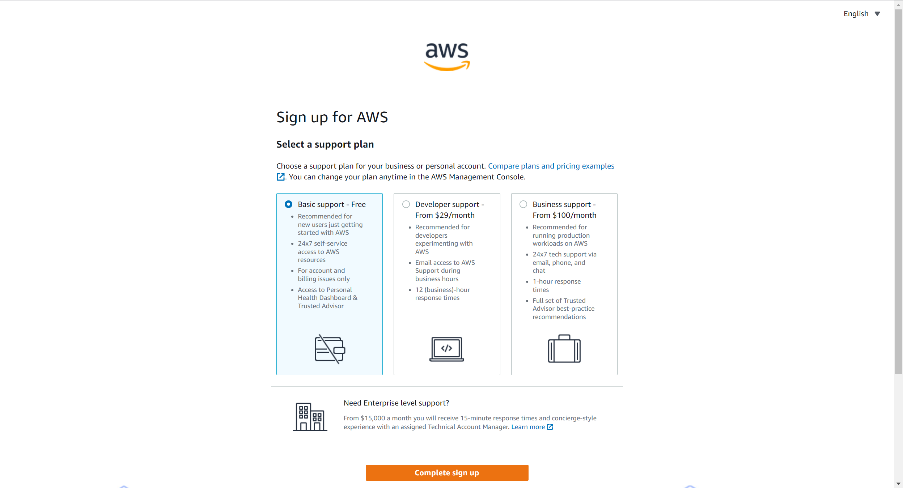
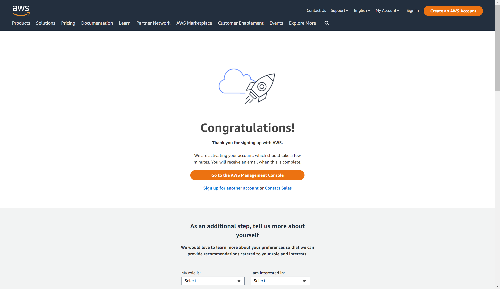

# Setting up an account for AWS Free Tier #

## Signing up for a new account ##

If you have not signed up for an AWS Free Tier account previously, go to [this link][1].

This page will walk you through a 5 step process to sign up for a new account, plus verify your email, a credit card, and a phone number. *The card you use for this signup may receive a $1 hold placed on it.*

For a quick rundown of the process involved in sign up, these are the steps and information required:

* Step 0

When you are first creating an AWS account on [this page][1], you will need to verify your email address.  Enter your root user email address and your AWS account name.

After you have entered your email address, press 'Verify email address', then check your email for a message with a link to verify your email address.

* Step 1

After you have verified your email address, you'll be directed to a page to enteryour root account password as the first step to creating your account.

* Step 2

For step 2, you'll be required to select how you plan to use AWS (business/personal), and enter contact information.

* Step 3

For step 3, you'll be required to verify billing info for your account.  *The card you use for this signup may receive a $1 hold placed on it.*

* Step 4

For step 4, you'll need to confirm your identity with either an SMS message or voice call to get a passcode.  Select your preferred method, click the button to snd SMS or call you, and wait for the code.

Once you have selected your contact method, your screenwill advance, and you will need to enter your code once you have received it.

* Step 5

For the final step, select your support plan and click 'Complete Sign Up'.  Be sure to select "Basic support - free" if you want everything on your account to remain free.

Congratulations, you now have an AWS account and will get credits/12 months of Free Tier access.

### Quick overview of the AWS Free Tier ###

>The AWS Free Tier provides customers the ability to explore and try out AWS services free of charge up to specified limits for each service. The Free Tier is comprised of three different types of offerings, a 12-month Free Tier, an Always Free offer, and short term trials.

>Eligibility for the AWS Free Tier:  
>Your AWS usage stays within the AWS Free Tier limits when all of these conditions are met:  
>You’re within the first 12 months of creating your AWS account.  
>You use only AWS services that offer AWS Free Tier benefits.  
>Your usage stays within the AWS Free Tier limits of those services.  
>If you use AWS services beyond one or more of these conditions, then that usage exceeds the Free Tier limits.  
>You're charged at the standard AWS billing rates for usage that exceeds the Free Tier limits.

*For more information about the AWS Free Tier, go to [this link][2].*

[1]:url=https://portal.aws.amazon.com/gp/aws/developer/registration/index.html?refid=em_127222

[2]:https://aws.amazon.com/free/?all-free-tier.sort-by=item.additionalFields.SortRank&all-free-tier.sort-order=asc&awsf.Free%20Tier%20Types=*all&awsf.Free%20Tier%20Categories=*all#Learn_more_about_AWS_Free_Tier_Products
